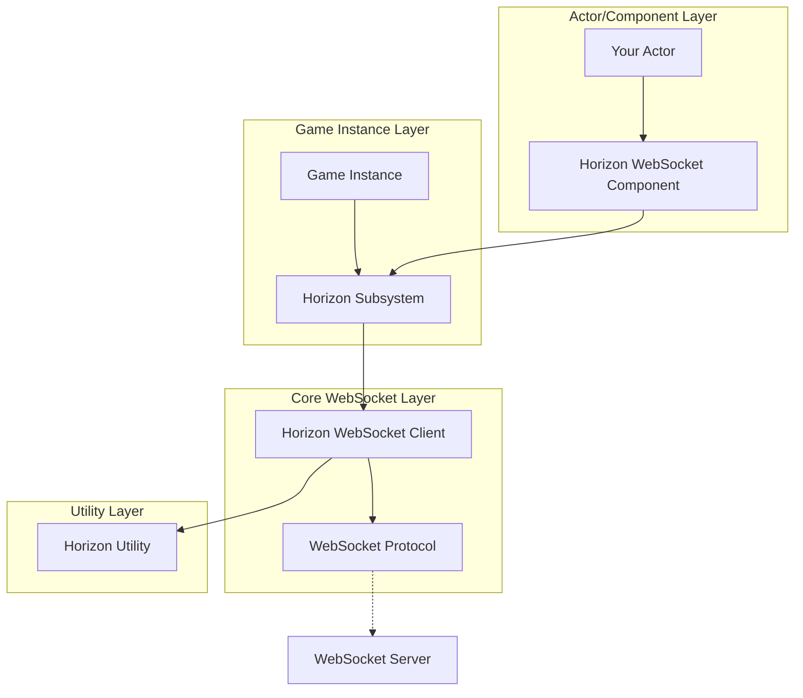
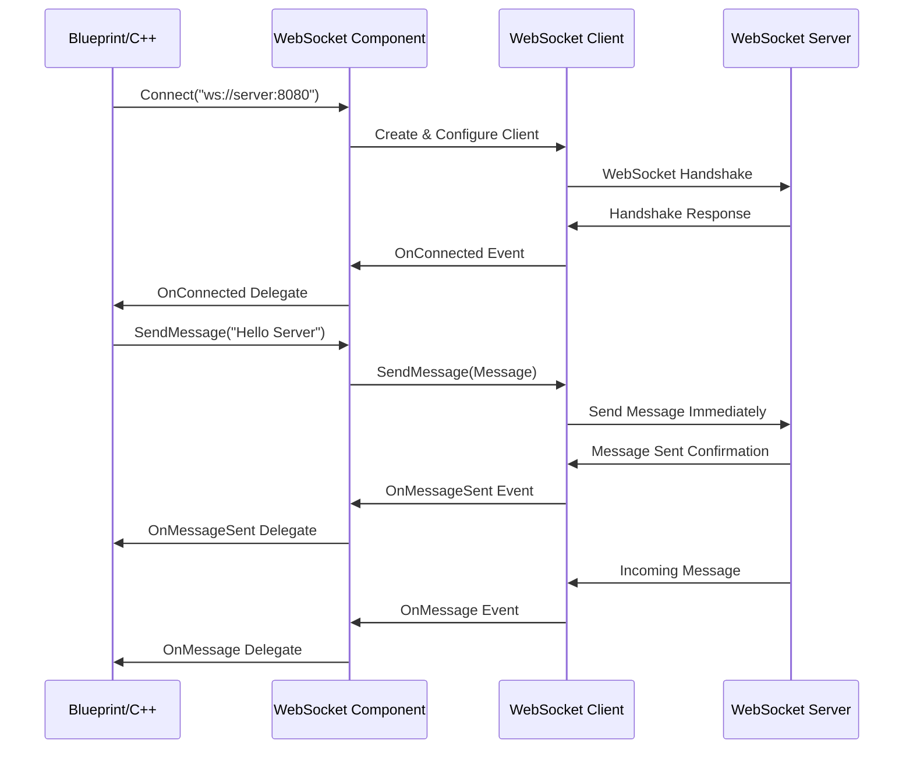
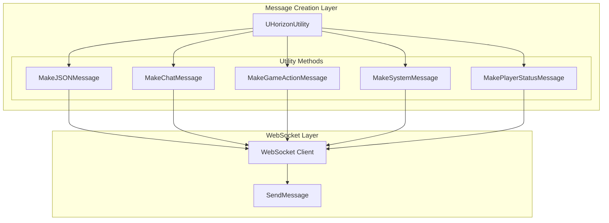
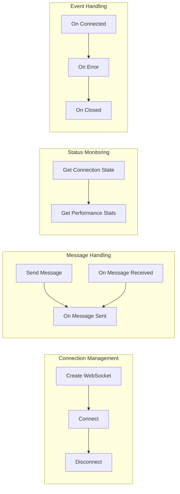
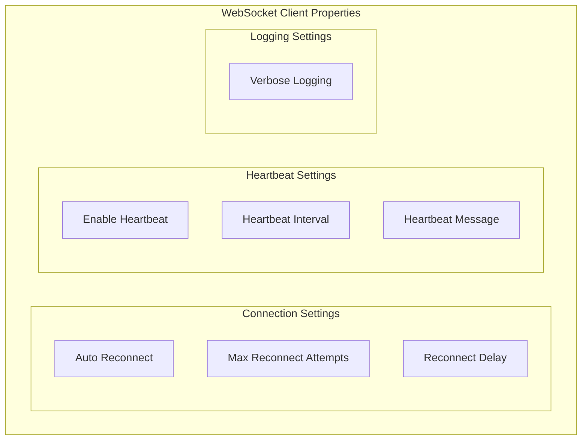

# Horizon WebSocket Plugin for Unreal Engine 5

A simple, lightweight WebSocket client implementation for Unreal Engine 5, designed for real-time communication with custom servers. Built with a clean, straightforward architecture inspired by SocketIOClient.

## 🚀 Key Features

- ✅ **Simple & Lightweight**: Clean architecture without complex batching or pooling
- ✅ **Thread-Safe**: Essential thread safety for WebSocket operations
- ✅ **Auto-Reconnection**: Configurable reconnection with simple retry logic
- ✅ **Immediate Sending**: All messages send immediately for low latency
- ✅ **Blueprint Compatible**: Full Blueprint node support with intuitive API
- ✅ **WebSocket Compliant**: Full RFC 6455 implementation with WSS support
- ✅ **Single-Client Architecture**: Optimized for single-player games and applications

## 🏗️ Architecture Overview

The Horizon WebSocket Plugin follows a clean, simple architecture inspired by SocketIOClient:



## 📊 Message Flow Architecture

Simple message flow for immediate sending:



## 🔧 Message Utility System

The plugin provides a simple utility system for creating and sending messages:



### Key Benefits:

1. **Centralized Message Creation**: All message creation handled by `UHorizonUtility`
2. **Blueprint Integration**: Full Blueprint node support for all functions
3. **Type Safety**: Proper message validation and formatting
4. **Consistent Structure**: All messages follow the same JSON patterns
5. **Immediate Sending**: All messages send immediately for low latency

### Usage Examples:

```cpp
// Create messages using the utility
FString ChatMessage = UHorizonUtility::MakeChatMessage("player123", "Hello world!", "general");
FString GameMessage = UHorizonUtility::MakeGameActionMessage("player123", "jump", {{"x", "100"}, {"y", "200"}});
FString SystemMessage = UHorizonUtility::MakeSystemMessage("maintenance", {{"duration", "5 minutes"}});

// Send messages (all send immediately)
WebSocket->SendMessage(ChatMessage);
WebSocket->SendMessage(GameMessage);
WebSocket->SendMessage(SystemMessage);
```

## 🎯 Blueprint Integration

The plugin provides comprehensive Blueprint support with intuitive nodes:



## 🔧 Configuration and Settings

The plugin provides simple configuration options through the WebSocket client properties:



## 🎮 Usage Examples

### Blueprint Usage

1. **Add WebSocket Component to your Actor:**
   ```
   Components > Add Component > Horizon WebSocket Component
   ```

2. **Configure the component:**
   - Set `Auto Connect` to `true`
   - Set `Auto Connect URL` to your server (e.g., `ws://localhost:8080`)
   - Configure performance settings as needed

3. **Handle WebSocket events:**
   ```
   Event Graph:
   - Event OnConnected → Print "Connected to server!"
   - Event OnMessage → Print "Received: " + Message
   - Event OnClosed → Print "Disconnected from server"
   ```

4. **Send messages:**
   ```
   Input Event → WebSocket Component → Send Message → "Hello Server!"
   ```

### C++ Usage

1. **Include the necessary headers:**
   ```cpp
   #include "Utils/HorizonUtility.h"
   #include "WebSocket/HorizonWebSocketClient.h"
   #include "WebSocket/HorizonMessage.h"
   ```

2. **Create and configure a WebSocket client:**
   ```cpp
   // Create WebSocket client
   UHorizonWebSocketClient* WebSocket = UHorizonUtility::CreateWebSocket(this);
   
   // Bind to events
   WebSocket->OnConnected.AddDynamic(this, &AMyActor::OnWebSocketConnected);
   WebSocket->OnMessage.AddDynamic(this, &AMyActor::OnWebSocketMessage);
   WebSocket->OnClosed.AddDynamic(this, &AMyActor::OnWebSocketClosed);
   
   // Connect to server
   WebSocket->Connect(TEXT("ws://localhost:8080"));
   ```

3. **Handle WebSocket events:**
   ```cpp
   UFUNCTION()
   void AMyActor::OnWebSocketConnected(bool bSuccess)
   {
       if (bSuccess)
       {
           UE_LOG(LogTemp, Log, TEXT("Connected to WebSocket server"));
           
           // Create and send a message using the utility
           FString WelcomeMessage = UHorizonUtility::MakeChatMessage(
               TEXT("player123"), 
               TEXT("Hello from Unreal!"), 
               TEXT("general")
           );
           WebSocket->SendMessage(WelcomeMessage);
       }
   }
   
   UFUNCTION()
   void AMyActor::OnWebSocketMessage(const FString& Message)
   {
       UE_LOG(LogTemp, Log, TEXT("Received message: %s"), *Message);
       
       // Parse incoming message
       FString Namespace, Event, Data;
       if (UHorizonUtility::ParseJSONMessage(Message, Namespace, Event, Data))
       {
           UE_LOG(LogTemp, Log, TEXT("Parsed - Namespace: %s, Event: %s"), *Namespace, *Event);
       }
   }
   
   UFUNCTION()
   void AMyActor::OnWebSocketClosed(int32 StatusCode, const FString& Reason, bool bWasClean)
   {
       UE_LOG(LogTemp, Log, TEXT("WebSocket closed: %d - %s"), StatusCode, *Reason);
   }
   ```

### Advanced C++ Usage

1. **Using the Horizon Subsystem directly:**
   ```cpp
   // Get the Horizon subsystem
   UHorizonSubsystem* HorizonSubsystem = GetGameInstance()->GetSubsystem<UHorizonSubsystem>();
   
   // Create and configure WebSocket
   UHorizonWebSocketClient* WebSocket = HorizonSubsystem->CreateWebSocket();
   WebSocket->SetBatchSize(1000);
   WebSocket->SetMaxPendingMessages(10000);
   
   // Connect with custom protocol
   WebSocket->Connect(TEXT("ws://localhost:8080"), TEXT("my-custom-protocol"));
   ```

2. **Performance monitoring:**
   ```cpp
   // Get performance metrics
   FString PerformanceStats = WebSocket->GetPerformanceStats(true);
   UE_LOG(LogTemp, Log, TEXT("WebSocket Performance: %s"), *PerformanceStats);
   
   // Check connection state
   EHorizonWebSocketState State = WebSocket->GetConnectionState();
   bool bIsConnected = WebSocket->IsConnected();
   ```

3. **Advanced message handling with utility:**
   ```cpp
   // Create different message types
   FString ChatMessage = UHorizonUtility::MakeChatMessage(
       TEXT("player123"), 
       TEXT("Hello everyone!"), 
       TEXT("general")
   );
   
   FString GameActionMessage = UHorizonUtility::MakeGameActionMessage(
       TEXT("player123"), 
       TEXT("jump"), 
       {
           {TEXT("x"), TEXT("100.5")},
           {TEXT("y"), TEXT("200.0")},
           {TEXT("z"), TEXT("50.0")}
       }
   );
   
   FString SystemMessage = UHorizonUtility::MakeSystemMessage(
       TEXT("maintenance"), 
       {
           {TEXT("duration"), TEXT("5 minutes")},
           {TEXT("reason"), TEXT("Server update")}
       }
   );
   
   // Send messages (all send immediately)
   WebSocket->SendMessage(ChatMessage);
   WebSocket->SendMessage(GameActionMessage);
   WebSocket->SendMessage(SystemMessage);
   
   // Send binary data
   TArray<uint8> BinaryData = {0x48, 0x65, 0x6C, 0x6C, 0x6F}; // "Hello"
   WebSocket->SendBinaryMessage(BinaryData);
   ```

## 📝 Configuration Reference

### WebSocket Client Properties

| Property | Default | Description |
|---------|---------|-------------|
| `bAutoReconnect` | `true` | Enable automatic reconnection |
| `MaxReconnectAttempts` | `5` | Maximum reconnection attempts |
| `ReconnectDelaySeconds` | `2.0s` | Delay between reconnection attempts |
| `bEnableHeartbeat` | `true` | Enable automatic heartbeat messages |
| `HeartbeatIntervalSeconds` | `30.0s` | Time between heartbeat messages |
| `HeartbeatMessage` | `"ping"` | Content of heartbeat messages |
| `bVerboseLogging` | `false` | Enable detailed debug logging |

## 🛠️ Troubleshooting

### Common Issues

1. **Connection fails immediately:**
   - Check if the server URL is correct
   - Verify the server is running and accepting connections
   - Check firewall settings

2. **Messages not being received:**
   - Ensure event delegates are properly bound
   - Check if the connection is still active
   - Verify server is sending valid WebSocket frames

3. **Simple connection issues:**
   - Check connection state using `GetConnectionState()`
   - Enable verbose logging with `bVerboseLogging = true`
   - Verify heartbeat settings if connection drops frequently

### Debug Settings

Enable debug mode in Project Settings > Plugins > Horizon:
- `Enable Debug Mode`: Shows additional logging
- `Debug Server URLs`: Pre-configured test servers
- `Auto Connect in PIE`: Automatically connect when playing in editor
- `Simulate Connection Failures`: Test error handling

## 🎯 Best Practices

1. **Use the WebSocket Component for simple scenarios:**
   ```cpp
   // Best for: Simple actor-based WebSocket usage
   UHorizonWebSocketComponent* Component = CreateDefaultSubobject<UHorizonWebSocketComponent>(TEXT("WebSocket"));
   ```

2. **Use the Subsystem for complex scenarios:**
   ```cpp
   // Best for: Game-wide WebSocket management
   UHorizonSubsystem* Subsystem = GetGameInstance()->GetSubsystem<UHorizonSubsystem>();
   ```

3. **All messages send immediately:**
   ```cpp
   // All messages send immediately - no need for special methods
   WebSocket->SendMessage(TEXT("Any message"));
   ```

4. **Use utility functions for structured messages:**
   ```cpp
   // Create messages using utility functions
   FString ChatMsg = UHorizonUtility::MakeChatMessage("player1", "Hello", "general");
   WebSocket->SendMessage(ChatMsg);
   ```

5. **Handle errors gracefully:**
   ```cpp
   WebSocket->OnConnectionError.AddDynamic(this, &AMyActor::OnConnectionError);
   WebSocket->OnClosed.AddDynamic(this, &AMyActor::OnConnectionClosed);
   ```

## 📄 License

This project is licensed under the MIT License - see the [LICENSE](LICENSE) file for details.

## 🤝 Contributing

Contributions are welcome! Please feel free to submit a Pull Request.

## 📞 Support

For support, please:
1. Check the [Issues](https://github.com/your-repo/horizon-plugin/issues) page
2. Review the troubleshooting section above
3. Enable debug logging for detailed diagnostics

---

**Made with ❤️ for the Unreal Engine community**
