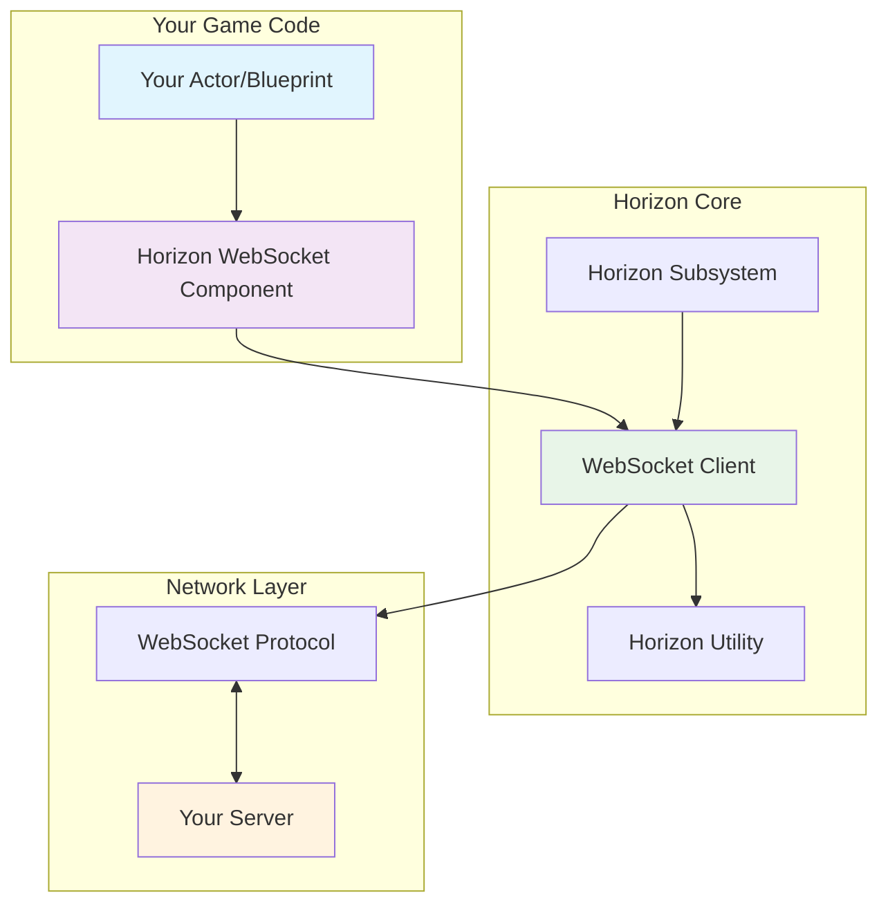
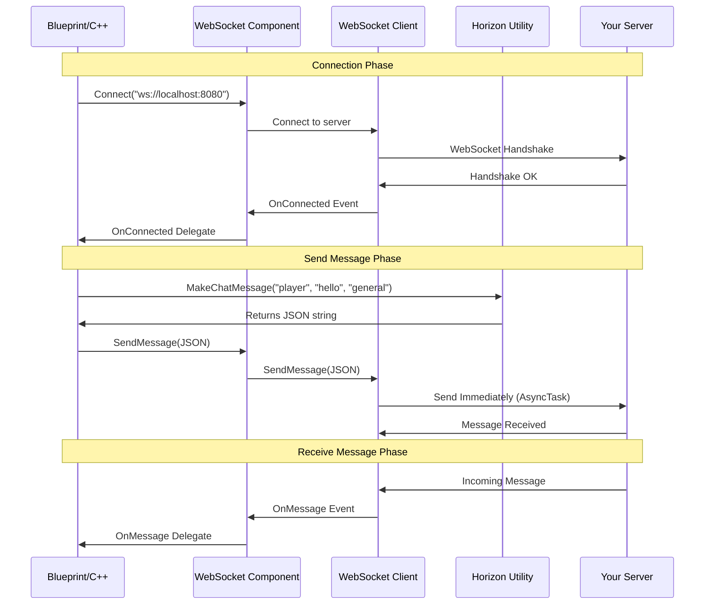
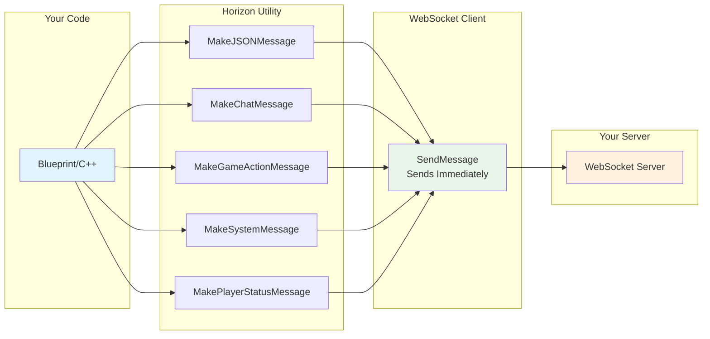
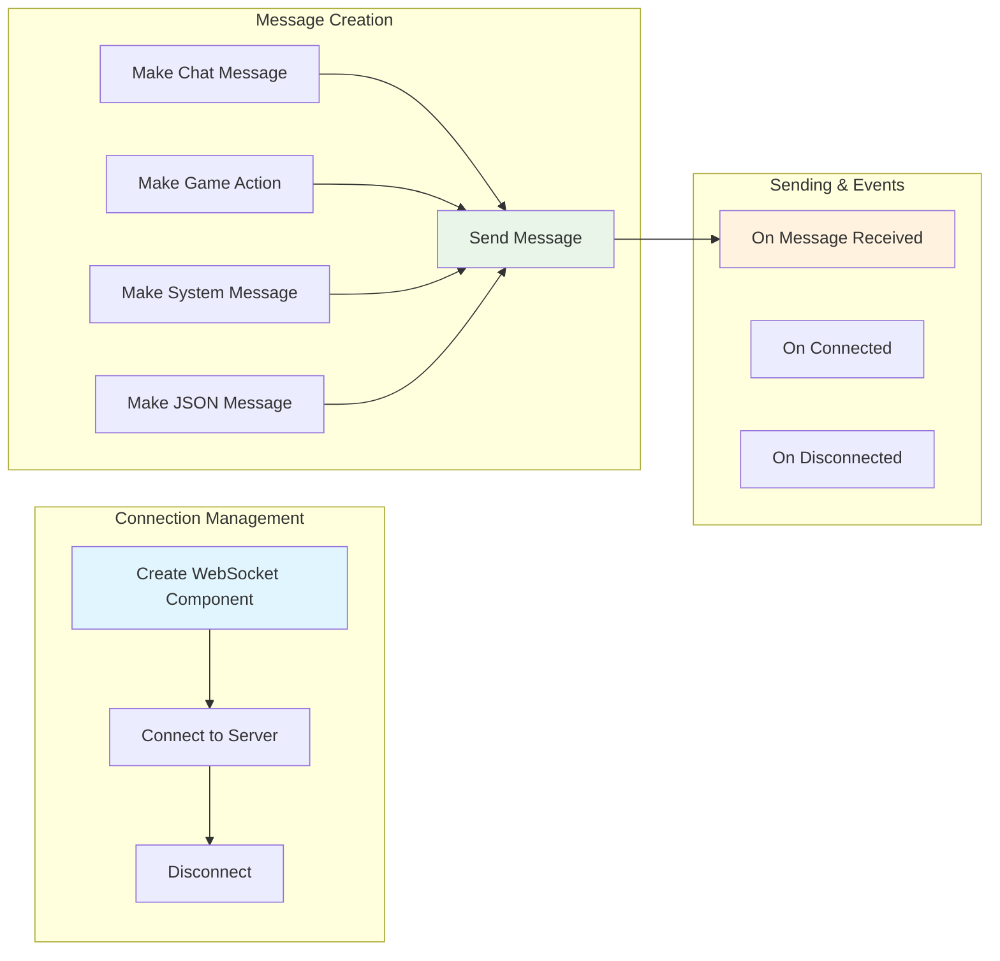
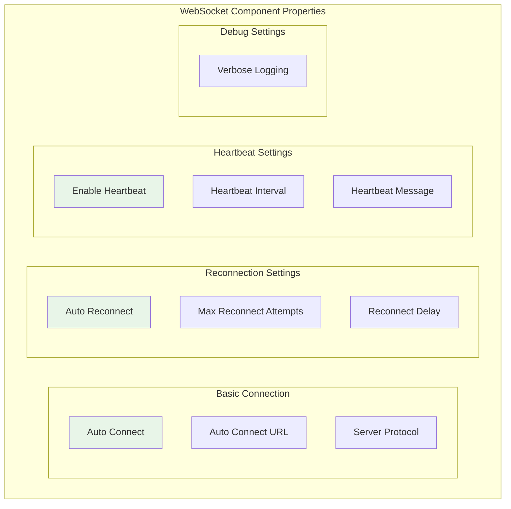

# Horizon WebSocket Plugin for Unreal Engine 5

A simple, lightweight WebSocket client implementation for Unreal Engine 5, designed for real-time communication with custom servers. Built with a clean, straightforward architecture inspired by SocketIOClient.

## 🚀 Key Features

- ✅ **Simple & Lightweight**: Clean architecture without complex batching or pooling
- ✅ **Thread-Safe**: Essential thread safety for WebSocket operations
- ✅ **Auto-Reconnection**: Configurable reconnection with simple retry logic
- ✅ **Immediate Sending**: All messages send immediately for low latency
- ✅ **Blueprint Compatible**: Full Blueprint node support with intuitive API
- ✅ **WebSocket Compliant**: Full RFC 6455 implementation with WSS support
- ✅ **Single-Client Architecture**: Optimized for single-player games and applications

## 🏗️ Architecture Overview

The Horizon WebSocket Plugin follows a clean, simple architecture inspired by SocketIOClient:



## 📊 Message Flow Architecture

Simple message flow - send immediately, no complex processing:



## 🔧 Message Creation System

Simple utility system for creating structured messages:



### Key Benefits:

1. **Simple Architecture**: Clean 3-layer design (Component → Client → Server)
2. **Immediate Sending**: All messages send instantly using AsyncTask
3. **Blueprint Integration**: Full Blueprint node support for all functions
4. **Type Safety**: Proper message validation and formatting using utilities
5. **Consistent Structure**: All messages follow the same JSON patterns

### Usage Examples:

```cpp
// Create messages using the utility (all return JSON strings ready to send)
FString ChatMessage = UHorizonUtility::MakeChatMessage("player123", "Hello world!", "general");
FString GameMessage = UHorizonUtility::MakeGameActionMessage("player123", "jump", {{"x", "100"}, {"y", "200"}});
FString SystemMessage = UHorizonUtility::MakeSystemMessage("maintenance", {{"duration", "5 minutes"}});

// Send messages (all send immediately via AsyncTask)
WebSocketComponent->SendMessage(ChatMessage);
WebSocketComponent->SendMessage(GameMessage);
WebSocketComponent->SendMessage(SystemMessage);

// Or send plain text (automatically wrapped in game message format)
WebSocketComponent->SendMessage("Hello Server!");
```

## 🎯 Blueprint Integration

The plugin provides comprehensive Blueprint support with intuitive nodes:



## 🔧 Configuration and Settings

The plugin provides simple configuration options through the WebSocket client:



## 🎮 Usage Examples

### Blueprint Usage

1. **Add WebSocket Component to your Actor:**
   ```
   Components > Add Component > Horizon WebSocket Component
   ```

2. **Configure the component:**
   - Set `Auto Connect` to `true`
   - Set `Auto Connect URL` to your server (e.g., `ws://localhost:8080`)
   - Configure reconnection and heartbeat settings as needed

3. **Handle WebSocket events:**
   ```
   Event Graph:
   - Event OnConnected → Print "Connected to server!"
   - Event OnMessage → Print "Received: " + Message
   - Event OnClosed → Print "Disconnected from server"
   ```

4. **Send messages using utility nodes:**
   ```
   Input Event → Make Chat Message ("player1", "Hello!", "general") → WebSocket Component → Send Message
   Input Event → Make Game Action ("player1", "jump", Data) → WebSocket Component → Send Message
   Input Event → Send Message → "Plain text message"
   ```

### C++ Usage

1. **Include the necessary headers:**
   ```cpp
   #include "Utils/HorizonUtility.h"
   #include "WebSocket/HorizonWebSocketComponent.h"
   #include "Framework/HorizonSubsystem.h"
   ```

2. **Add component to your Actor:**
   ```cpp
   // In Actor constructor
   WebSocketComponent = CreateDefaultSubobject<UHorizonWebSocketComponent>(TEXT("WebSocketComponent"));
   
   // In BeginPlay
   void AMyActor::BeginPlay()
   {
       Super::BeginPlay();
       
       // Bind to events
       WebSocketComponent->OnConnected.AddDynamic(this, &AMyActor::OnWebSocketConnected);
       WebSocketComponent->OnMessage.AddDynamic(this, &AMyActor::OnWebSocketMessage);
       WebSocketComponent->OnClosed.AddDynamic(this, &AMyActor::OnWebSocketClosed);
       
       // Connect to server
       WebSocketComponent->Connect(TEXT("ws://localhost:8080"));
   }
   ```

3. **Handle WebSocket events:**
   ```cpp
   UFUNCTION()
   void AMyActor::OnWebSocketConnected(bool bSuccess)
   {
       if (bSuccess)
       {
           UE_LOG(LogTemp, Log, TEXT("Connected to WebSocket server"));
           
           // Create and send a message using the utility
           FString WelcomeMessage = UHorizonUtility::MakeChatMessage(
               TEXT("player123"), 
               TEXT("Hello from Unreal!"), 
               TEXT("general")
           );
           WebSocketComponent->SendMessage(WelcomeMessage);
       }
   }
   
   UFUNCTION()
   void AMyActor::OnWebSocketMessage(const FString& Message)
   {
       UE_LOG(LogTemp, Log, TEXT("Received message: %s"), *Message);
       
       // Parse incoming message
       FString Namespace, Event, Data;
       if (UHorizonUtility::ParseJSONMessage(Message, Namespace, Event, Data))
       {
           UE_LOG(LogTemp, Log, TEXT("Parsed - Namespace: %s, Event: %s"), *Namespace, *Event);
       }
   }
   
   UFUNCTION()
   void AMyActor::OnWebSocketClosed(int32 StatusCode, const FString& Reason, bool bWasClean)
   {
       UE_LOG(LogTemp, Log, TEXT("WebSocket closed: %d - %s"), StatusCode, *Reason);
   }
   ```

### Advanced C++ Usage

1. **Using the Horizon Subsystem directly:**
   ```cpp
   // Get the Horizon subsystem
   UHorizonSubsystem* HorizonSubsystem = GetGameInstance()->GetSubsystem<UHorizonSubsystem>();
   
   // Create WebSocket client through subsystem
   UHorizonWebSocketClient* WebSocketClient = HorizonSubsystem->CreateWebSocket();
   
   // Connect with custom protocol
   WebSocketClient->Connect(TEXT("ws://localhost:8080"), TEXT("my-custom-protocol"));
   ```

2. **Connection monitoring:**
   ```cpp
   // Check connection state
   EHorizonWebSocketState State = WebSocketComponent->GetConnectionState();
   bool bIsConnected = WebSocketComponent->IsConnected();
   
   // Get connection info
   FString Stats = UHorizonUtility::GetPerformanceStatistics(this, true);
   UE_LOG(LogTemp, Log, TEXT("WebSocket Stats: %s"), *Stats);
   ```

3. **Advanced message creation and sending:**
   ```cpp
   // Create different message types using utilities
   FString ChatMessage = UHorizonUtility::MakeChatMessage(
       TEXT("player123"), 
       TEXT("Hello everyone!"), 
       TEXT("general")
   );
   
   FString GameActionMessage = UHorizonUtility::MakeGameActionMessage(
       TEXT("player123"), 
       TEXT("jump"), 
       {
           {TEXT("x"), TEXT("100.5")},
           {TEXT("y"), TEXT("200.0")},
           {TEXT("z"), TEXT("50.0")}
       }
   );
   
   FString SystemMessage = UHorizonUtility::MakeSystemMessage(
       TEXT("maintenance"), 
       {
           {TEXT("duration"), TEXT("5 minutes")},
           {TEXT("reason"), TEXT("Server update")}
       }
   );
   
   // Send messages (all send immediately via AsyncTask)
   WebSocketComponent->SendMessage(ChatMessage);
   WebSocketComponent->SendMessage(GameActionMessage);
   WebSocketComponent->SendMessage(SystemMessage);
   
   // Send plain text (automatically wrapped)
   WebSocketComponent->SendMessage(TEXT("Simple text message"));
   
   // Send binary data
   TArray<uint8> BinaryData = {0x48, 0x65, 0x6C, 0x6C, 0x6F}; // "Hello"
   WebSocketComponent->SendBinaryMessage(BinaryData);
   ```

## 📝 Configuration Reference

### WebSocket Client Properties

| Property | Default | Description |
|---------|---------|-------------|
| `bAutoReconnect` | `true` | Enable automatic reconnection |
| `MaxReconnectAttempts` | `5` | Maximum reconnection attempts |
| `ReconnectDelaySeconds` | `2.0s` | Delay between reconnection attempts |
| `bEnableHeartbeat` | `true` | Enable automatic heartbeat messages |
| `HeartbeatIntervalSeconds` | `30.0s` | Time between heartbeat messages |
| `HeartbeatMessage` | `"ping"` | Content of heartbeat messages |
| `bVerboseLogging` | `false` | Enable detailed debug logging |

## 🛠️ Troubleshooting

### Common Issues

1. **Connection fails immediately:**
   - Check if the server URL is correct and accessible
   - Verify the server is running and accepting WebSocket connections
   - Check firewall settings and network connectivity

2. **Messages not being received:**
   - Ensure event delegates are properly bound in Blueprint or C++
   - Check if the connection is still active using `IsConnected()`
   - Verify server is sending valid WebSocket frames

3. **Connection drops frequently:**
   - Check heartbeat settings (`Enable Heartbeat`, `Heartbeat Interval`)
   - Verify server supports and responds to heartbeat messages
   - Check network stability and connection quality

### Debug Settings

Enable verbose logging for detailed diagnostics:
```cpp
// In C++
WebSocketComponent->SetVerboseLogging(true);
```

```
// In Blueprint
WebSocket Component → Set Verbose Logging → True
```

This will show detailed logs for:
- Connection attempts and handshakes
- Message sending and receiving
- Heartbeat messages
- Reconnection attempts

## 🎯 Best Practices

1. **Use the WebSocket Component for most scenarios:**
   ```cpp
   // Recommended: Simple component-based approach
   UHorizonWebSocketComponent* Component = CreateDefaultSubobject<UHorizonWebSocketComponent>(TEXT("WebSocket"));
   ```

2. **Use the Subsystem for game-wide management:**
   ```cpp
   // For complex scenarios: Game-wide WebSocket management
   UHorizonSubsystem* Subsystem = GetGameInstance()->GetSubsystem<UHorizonSubsystem>();
   UHorizonWebSocketClient* Client = Subsystem->CreateWebSocket();
   ```

3. **All messages send immediately:**
   ```cpp
   // Simple immediate sending - no batching or queuing
   WebSocketComponent->SendMessage(TEXT("Any message"));
   ```

4. **Use utility functions for structured messages:**
   ```cpp
   // Create structured messages using utilities
   FString ChatMsg = UHorizonUtility::MakeChatMessage("player1", "Hello", "general");
   WebSocketComponent->SendMessage(ChatMsg);
   
   // Or send plain text (automatically wrapped)
   WebSocketComponent->SendMessage("Plain text message");
   ```

5. **Handle connection events gracefully:**
   ```cpp
   // Always bind to connection events for robust error handling
   WebSocketComponent->OnConnected.AddDynamic(this, &AMyActor::OnConnected);
   WebSocketComponent->OnClosed.AddDynamic(this, &AMyActor::OnClosed);
   WebSocketComponent->OnConnectionError.AddDynamic(this, &AMyActor::OnError);
   ```

6. **Use auto-reconnection for production:**
   ```cpp
   // Enable auto-reconnection for robust connections
   WebSocketComponent->SetAutoReconnect(true);
   WebSocketComponent->SetMaxReconnectAttempts(10);
   WebSocketComponent->SetReconnectDelaySeconds(5.0f);
   ```

## 📄 License

This project is licensed under the MIT License - see the [LICENSE](LICENSE) file for details.

## 🤝 Contributing

Contributions are welcome! Please feel free to submit a Pull Request.

## 📞 Support

For support, please:
1. Check the [Issues](https://github.com/your-repo/horizon-plugin/issues) page
2. Review the troubleshooting section above
3. Enable debug logging for detailed diagnostics

---

**Made with ❤️ for the Unreal Engine community**
