# HorizonWebSocketClient

A high-performance, thread-safe WebSocket client implementation for Unreal Engine with support for both **batched** and **immediate** message processing modes.

## Features

- ✅ **Dual Processing Modes**: Choose between batched (optimized) or immediate (real-time) processing
- ✅ **Thread-Safe**: All operations are thread-safe with proper mutex protection
- ✅ **Auto-Reconnection**: Configurable reconnection with exponential backoff
- ✅ **Heartbeat Support**: Keep connections alive with customizable ping/pong
- ✅ **Blueprint Compatible**: Full Blueprint node support
- ✅ **Binary & Text Messages**: Support for both message types
- ✅ **WebSocket Protocol Compliant**: Full RFC 6455 implementation
- ✅ **Secure Connections**: Support for both WS and WSS protocols

## Processing Modes

### Batched Processing (Default)
- Messages queued and processed on game thread tick
- **Latency**: ~16ms (one frame at 60fps)
- **CPU Usage**: Lower for high-frequency messaging
- **Use Case**: General messaging, non-critical data

### Immediate Processing
- Messages processed immediately upon receipt/send
- **Latency**: <1ms
- **CPU Usage**: Slightly higher due to immediate processing
- **Use Case**: Real-time games, trading systems, live collaboration

## Quick Start

### Complete Blueprint Implementation Example


## Blueprint Step-by-Step Guide

### 1. Initial Setup in Blueprint

```mermaid
graph LR
    A["🎮 Event BeginPlay"] --> B["📦 Create Object from Class"]
    B --> C["🔗 HorizonWebSocketClient"]
    C --> D["💾 Set Variable: WebSocketClient"]
    
    subgraph "Node Details"
        B1["Class: Horizon Web Socket Client<br/>Return Value → WebSocketClient Variable"]
    end
    
    B -.-> B1
```



### 2. Configuration Nodes Chain


### 3. Event Binding Chain

```mermaid
graph LR
    A["📝 Set Verbose Logging"] --> B1["🔗 Bind Event to On Connected"]
    B1 --> B2["🔗 Bind Event to On Message"]
    B2 --> B3["🔗 Bind Event to On Message Sent"]
    B3 --> B4["🔗 Bind Event to On Closed"]
    B4 --> B5["🔗 Bind Event to On Raw Message"]
    B5 --> B6["🔗 Bind Event to On Connection Error"]
    
    subgraph "Custom Events"
        E1["Handle Connected"]
        E2["Handle Message"]
        E3["Handle Message Sent"]
        E4["Handle Closed"]
        E5["Handle Raw Message"]
        E6["Handle Connection Error"]
    end
    
    B1 -.-> E1
    B2 -.-> E2
    B3 -.-> E3
    B4 -.-> E4
    B5 -.-> E5
    B6 -.-> E6
```



### 4. Connection Node

```mermaid
graph LR
    A["🔗 Bind Event to On Connection Error"] --> B["🌐 Connect"]
    
    subgraph "Connect Parameters"
        P1["URL: ws://localhost:8080/websocket"]
        P2["Protocol: (leave empty)"]
    end
    
    B --> P1
    B --> P2
    
    B --> C["✅ Execution continues to event handlers"]
```



## C++ Implementation Examples

### Basic Setup

```cpp
// YourGameMode.h
UCLASS()
class YOURGAME_API AYourGameMode : public AGameModeBase
{
    GENERATED_BODY()

public:
    AYourGameMode();

protected:
    virtual void BeginPlay() override;

    UPROPERTY(VisibleAnywhere, BlueprintReadOnly, Category = "WebSocket")
    UHorizonWebSocketClient* WebSocketClient;

    // Event handlers
    UFUNCTION()
    void OnWebSocketConnected(bool bSuccess);
    
    UFUNCTION()
    void OnWebSocketMessage(const FString& Message);
    
    UFUNCTION()
    void OnWebSocketMessageSent(const FString& Message);
    
    UFUNCTION()
    void OnWebSocketClosed(int32 StatusCode, const FString& Reason, bool bWasClean);
    
    UFUNCTION()
    void OnWebSocketConnectionError(const FString& Error);
    
    UFUNCTION()
    void OnWebSocketRawMessage(const TArray<uint8>& Data, int32 Count, int32 Remaining);
};
```

### Implementation with Immediate Processing

```cpp
// YourGameMode.cpp
AYourGameMode::AYourGameMode()
{
    WebSocketClient = CreateDefaultSubobject<UHorizonWebSocketClient>(TEXT("WebSocketClient"));
}

void AYourGameMode::BeginPlay()
{
    Super::BeginPlay();

    if (WebSocketClient)
    {
        // Configure for immediate processing (real-time)
        WebSocketClient->bImmediateProcessing = true;
        
        // Connection settings
        WebSocketClient->bAutoReconnect = true;
        WebSocketClient->MaxReconnectAttempts = 5;
        WebSocketClient->ReconnectDelaySeconds = 2.0f;
        
        // Heartbeat settings
        WebSocketClient->bEnableHeartbeat = true;
        WebSocketClient->HeartbeatIntervalSeconds = 30.0f;
        WebSocketClient->HeartbeatMessage = TEXT("ping");
        
        // Logging
        WebSocketClient->bVerboseLogging = true;

        // Bind events
        WebSocketClient->OnConnected.AddDynamic(this, &AYourGameMode::OnWebSocketConnected);
        WebSocketClient->OnMessage.AddDynamic(this, &AYourGameMode::OnWebSocketMessage);
        WebSocketClient->OnMessageSent.AddDynamic(this, &AYourGameMode::OnWebSocketMessageSent);
        WebSocketClient->OnClosed.AddDynamic(this, &AYourGameMode::OnWebSocketClosed);
        WebSocketClient->OnConnectionError.AddDynamic(this, &AYourGameMode::OnWebSocketConnectionError);
        WebSocketClient->OnRawMessage.AddDynamic(this, &AYourGameMode::OnWebSocketRawMessage);

        // Connect to server
        WebSocketClient->Connect("ws://localhost:8080/websocket", "");
    }
}

void AYourGameMode::OnWebSocketConnected(bool bSuccess)
{
    if (bSuccess)
    {
        UE_LOG(LogTemp, Log, TEXT("✅ WebSocket connected successfully!"));
        
        // Send initial message
        WebSocketClient->SendMessage(TEXT("Hello from Unreal Engine!"));
        
        // Send binary data
        TArray<uint8> BinaryData = {0x48, 0x65, 0x6C, 0x6C, 0x6F}; // "Hello"
        WebSocketClient->SendBinaryMessage(BinaryData);
    }
    else
    {
        UE_LOG(LogTemp, Error, TEXT("❌ Failed to connect to WebSocket"));
    }
}

void AYourGameMode::OnWebSocketMessage(const FString& Message)
{
    UE_LOG(LogTemp, Log, TEXT("📨 Received: %s"), *Message);
    
    // Echo back with timestamp
    FDateTime Now = FDateTime::Now();
    FString EchoMessage = FString::Printf(TEXT("Echo at %s: %s"), 
        *Now.ToString(), *Message);
    WebSocketClient->SendMessage(EchoMessage);
}

void AYourGameMode::OnWebSocketMessageSent(const FString& Message)
{
    UE_LOG(LogTemp, Log, TEXT("📤 Sent: %s"), *Message);
}

void AYourGameMode::OnWebSocketClosed(int32 StatusCode, const FString& Reason, bool bWasClean)
{
    UE_LOG(LogTemp, Warning, TEXT("🔌 Connection closed - Code: %d, Reason: %s, Clean: %s"), 
        StatusCode, *Reason, bWasClean ? TEXT("Yes") : TEXT("No"));
}

void AYourGameMode::OnWebSocketConnectionError(const FString& Error)
{
    UE_LOG(LogTemp, Error, TEXT("💥 Connection error: %s"), *Error);
}

void AYourGameMode::OnWebSocketRawMessage(const TArray<uint8>& Data, int32 Count, int32 Remaining)
{
    UE_LOG(LogTemp, Log, TEXT("📦 Received binary data: %d bytes"), Count);
    
    // Convert to hex string for logging
    FString HexString = FString::Printf(TEXT("Raw data: "));
    for (int32 i = 0; i < FMath::Min(Data.Num(), 20); i++) // Log first 20 bytes
    {
        HexString += FString::Printf(TEXT("%02X "), Data[i]);
    }
    if (Data.Num() > 20)
    {
        HexString += TEXT("...");
    }
    UE_LOG(LogTemp, Log, TEXT("%s"), *HexString);
}
```

### Real-Time Game Example

```cpp
// Real-time multiplayer game example
class YOURGAME_API AMultiplayerGameMode : public AGameModeBase
{
    GENERATED_BODY()

public:
    // Send player position update
    UFUNCTION(BlueprintCallable)
    void SendPlayerPosition(APlayerController* Player, FVector Position, FRotator Rotation);
    
    // Send game state update
    UFUNCTION(BlueprintCallable)
    void SendGameStateUpdate(const FString& GameState);

protected:
    UPROPERTY()
    UHorizonWebSocketClient* GameWebSocket;
    
    UFUNCTION()
    void OnGameMessage(const FString& Message);
};

void AMultiplayerGameMode::BeginPlay()
{
    Super::BeginPlay();
    
    GameWebSocket = NewObject<UHorizonWebSocketClient>(this);
    
    // CRITICAL: Enable immediate processing for real-time games
    GameWebSocket->bImmediateProcessing = true;
    
    // Optimize for low latency
    GameWebSocket->bEnableHeartbeat = true;
    GameWebSocket->HeartbeatIntervalSeconds = 10.0f; // More frequent heartbeats
    
    GameWebSocket->OnMessage.AddDynamic(this, &AMultiplayerGameMode::OnGameMessage);
    GameWebSocket->Connect("ws://gameserver.com:8080/game", "realtime-game");
}

void AMultiplayerGameMode::SendPlayerPosition(APlayerController* Player, FVector Position, FRotator Rotation)
{
    if (GameWebSocket && GameWebSocket->IsConnected())
    {
        // Create JSON message
        FString PositionMessage = FString::Printf(TEXT(
            "{"
            "\"type\":\"player_position\","
            "\"player_id\":\"%s\","
            "\"position\":{\"x\":%.2f,\"y\":%.2f,\"z\":%.2f},"
            "\"rotation\":{\"pitch\":%.2f,\"yaw\":%.2f,\"roll\":%.2f},"
            "\"timestamp\":%lld"
            "}"), 
            *Player->GetUniqueID().ToString(),
            Position.X, Position.Y, Position.Z,
            Rotation.Pitch, Rotation.Yaw, Rotation.Roll,
            FDateTime::Now().ToUnixTimestamp()
        );
        
        // Send immediately (< 1ms latency with immediate processing)
        GameWebSocket->SendMessage(PositionMessage);
    }
}

void AMultiplayerGameMode::OnGameMessage(const FString& Message)
{
    // Parse and handle game messages immediately
    // This fires within ~1ms of message receipt in immediate mode
    
    // Example: Parse JSON and update game state
    TSharedPtr<FJsonObject> JsonObject;
    TSharedRef<TJsonReader<>> Reader = TJsonReaderFactory<>::Create(Message);
    
    if (FJsonSerializer::Deserialize(Reader, JsonObject) && JsonObject.IsValid())
    {
        FString MessageType = JsonObject->GetStringField(TEXT("type"));
        
        if (MessageType == TEXT("player_position"))
        {
            // Handle player position update immediately
            FString PlayerID = JsonObject->GetStringField(TEXT("player_id"));
            // ... update player position in real-time
        }
        else if (MessageType == TEXT("game_event"))
        {
            // Handle game events immediately
            FString EventType = JsonObject->GetStringField(TEXT("event"));
            // ... process game event
        }
    }
}
```

### Trading/Financial Data Example

```cpp
// High-frequency trading data example
class YOURGAME_API ATradingDataReceiver : public AActor
{
    GENERATED_BODY()

public:
    ATradingDataReceiver();

protected:
    virtual void BeginPlay() override;

    UPROPERTY()
    UHorizonWebSocketClient* TradingWebSocket;
    
    UFUNCTION()
    void OnMarketData(const FString& Message);
    
    UFUNCTION()
    void OnTradingBinaryData(const TArray<uint8>& Data, int32 Count, int32 Remaining);

private:
    // Track latency for performance monitoring
    TArray<float> LatencyMeasurements;
    FDateTime LastMessageTime;
};

void ATradingDataReceiver::BeginPlay()
{
    Super::BeginPlay();
    
    TradingWebSocket = NewObject<UHorizonWebSocketClient>(this);
    
    // CRITICAL: Immediate processing for financial data
    TradingWebSocket->bImmediateProcessing = true;
    
    // Optimize for ultra-low latency
    TradingWebSocket->bEnableHeartbeat = true;
    TradingWebSocket->HeartbeatIntervalSeconds = 5.0f; // Very frequent heartbeats
    TradingWebSocket->bVerboseLogging = false; // Reduce logging overhead
    
    TradingWebSocket->OnMessage.AddDynamic(this, &ATradingDataReceiver::OnMarketData);
    TradingWebSocket->OnRawMessage.AddDynamic(this, &ATradingDataReceiver::OnTradingBinaryData);
    
    // Connect to trading data feed
    TradingWebSocket->Connect("wss://api.trading.com/v1/feed", "market-data");
}

void ATradingDataReceiver::OnMarketData(const FString& Message)
{
    // Process market data with minimal latency
    FDateTime ReceiveTime = FDateTime::Now();
    
    // Calculate processing latency
    if (!LastMessageTime.GetTicks() == 0)
    {
        float LatencyMs = (ReceiveTime - LastMessageTime).GetTotalMilliseconds();
        LatencyMeasurements.Add(LatencyMs);
        
        // Log every 100 messages
        if (LatencyMeasurements.Num() % 100 == 0)
        {
            float AvgLatency = 0.0f;
            for (float Latency : LatencyMeasurements)
            {
                AvgLatency += Latency;
            }
            AvgLatency /= LatencyMeasurements.Num();
            
            UE_LOG(LogTemp, Log, TEXT("📊 Avg processing latency: %.2fms"), AvgLatency);
            LatencyMeasurements.Empty(); // Reset for next batch
        }
    }
    
    LastMessageTime = ReceiveTime;
    
    // Parse market data immediately
    // {"symbol":"BTCUSD","price":45000.50,"volume":1.25,"timestamp":1640995200}
    TSharedPtr<FJsonObject> JsonObject;
    TSharedRef<TJsonReader<>> Reader = TJsonReaderFactory<>::Create(Message);
    
    if (FJsonSerializer::Deserialize(Reader, JsonObject) && JsonObject.IsValid())
    {
        FString Symbol = JsonObject->GetStringField(TEXT("symbol"));
        double Price = JsonObject->GetNumberField(TEXT("price"));
        double Volume = JsonObject->GetNumberField(TEXT("volume"));
        
        // Update trading UI immediately (< 1ms with immediate processing)
        // Broadcast to trading widgets, update charts, etc.
    }
}
```

## Configuration Reference

| Property | Type | Default | Description |
|----------|------|---------|-------------|
| `bImmediateProcessing` | `bool` | `false` | Enable immediate message processing (< 1ms latency) |
| `bAutoReconnect` | `bool` | `true` | Automatically reconnect on connection loss |
| `MaxReconnectAttempts` | `int32` | `5` | Maximum number of reconnection attempts |
| `ReconnectDelaySeconds` | `float` | `2.0f` | Base delay between reconnection attempts |
| `bEnableHeartbeat` | `bool` | `true` | Enable heartbeat/keepalive mechanism |
| `HeartbeatIntervalSeconds` | `float` | `30.0f` | Interval between heartbeat messages |
| `HeartbeatMessage` | `FString` | `"ping"` | Message to send for heartbeat |
| `bVerboseLogging` | `bool` | `false` | Enable detailed logging |

## Performance Comparison


## Thread Safety


## Best Practices

### When to Use Immediate Processing
- ✅ Real-time multiplayer games
- ✅ Trading/financial applications
- ✅ Live collaboration tools
- ✅ IoT sensor data
- ✅ Video streaming control

### When to Use Batched Processing
- ✅ General web communication
- ✅ Non-critical notifications
- ✅ Bulk data transfer
- ✅ High-frequency, non-latency-sensitive data
- ✅ Battery-powered devices

### Performance Tips
1. **Use immediate processing sparingly** - Only when latency matters
2. **Optimize heartbeat intervals** - Lower for critical connections
3. **Disable verbose logging** in production for immediate mode
4. **Monitor CPU usage** with high-frequency immediate processing
5. **Use binary messages** for large data transfers

## Troubleshooting

### Common Issues

**High CPU Usage in Immediate Mode**
```cpp
// Solution: Increase worker thread sleep time slightly
WebSocketClient->bImmediateProcessing = true;
// The worker thread automatically uses 1ms sleep in immediate mode
// vs 10ms in batched mode
```

**Connection Timeouts**
```cpp
// Solution: Adjust heartbeat settings
WebSocketClient->bEnableHeartbeat = true;
WebSocketClient->HeartbeatIntervalSeconds = 15.0f; // More frequent
```

**Memory Leaks**
```cpp
// Ensure proper cleanup in EndPlay
void AYourActor::EndPlay(const EEndPlayReason::Type EndPlayReason)
{
    if (WebSocketClient)
    {
        WebSocketClient->Disconnect();
        WebSocketClient = nullptr;
    }
    Super::EndPlay(EndPlayReason);
}
```

## Contributing

Please ensure all contributions maintain thread safety and include both Blueprint and C++ examples in documentation.
